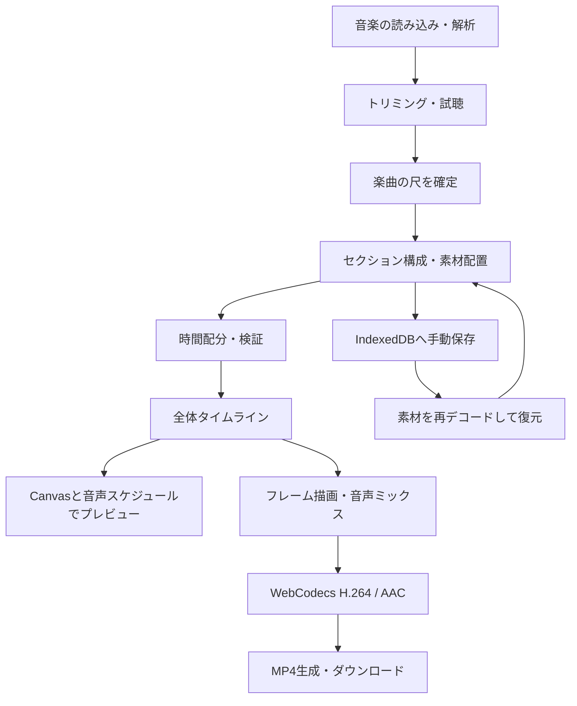

# Kanaderu 仕様・画面設計

更新日：2026-09-21。現在のセクション編集対応実装を記載します。操作手順は [セクション編集ガイド](SECTION_EDITING.md) を参照してください。

## 1. 処理の全体像

各処理はクライアント側で実行します。画像・音声・動画用のバックエンドはありません。

## 2. 画面

| 画面 | 役割 |
| --- | --- |
| ステップ1：音楽・尺の確定 | 楽曲の読み込み、BPM・エネルギー解析、波形表示、試聴、使用範囲の指定 |
| ステップ2：セクション構成 | セクションの追加・削除・並べ替え、秒数設定、写真・動画・表紙の配置 |
| ステップ3：プレビュー・出力 | 全体の再生・シーク、章への移動、演出・画質・縦横比・全体フェード、MP4出力 |
| 保存・復元 | 素材を含めた編集状態をブラウザに保存し、再開する |

標準は1曲を全体で通して使うモードです。音楽未選択時はセクション構成へ進めません。読み込み後は確定ボタンまたはヘッダーの「セクション構成」から使用範囲を確定して進めます。トリミング編集中の値と確定した楽曲は分離し、再確定まで既存のセクション時間を変更しません。

## 3. データモデル

定義は `src/types/project.ts` にあります。

- `ProjectSection`：安定したID、名前、時間モード、手動秒数、楽曲、素材配列、表紙・エンドカード、楽曲音量とフェード。
- `PhotoItem`：元ファイル、ID、表示用画像、固定秒数、切り替え効果。動画の場合は `video` に使用範囲・URL・元音声などを保持。
- `SongData`：元ファイル、デコード済み音声、BPM・ビート・エネルギー情報、トリミング範囲。
- `SectionRange`：全体における各セクションの開始時間と長さ。
- `TimelineSegment`：セクションID、素材ID、開始・終了時間、演出。合成時に全体時間軸へ変換。
- `ProjectConfig`：全体の演出、画質、縦横比、楽曲モード、素材、確定タイムライン。

元のセクション配列は編集状態として維持し、配分後の時間・全体タイムラインはそこから導出します。

## 4. 時間配分

### 全体を通すモード

全体時間は確定した `trimEnd - trimStart` です。

1. 手動指定のセクション時間を確保します。
2. 残り時間を自動セクションへ配分します。
3. 表紙・エンドカード、固定写真、動画の使用時間と、自動写真1枚あたり1.5秒の最低時間を考慮します。
4. 固定素材だけのセクションは素材の合計時間を使い、余りは時間を吸収できる自動セクションへ回します。
5. 未配分の余りや超過があれば表示し、書き出しを禁止します。

素材なし、有効な表紙への画像未設定、動画の不正な使用範囲も検証します。楽曲未確定時に算出する仮の値を、出力可能な全体尺として扱いません。

### セクション別モード

各セクションで楽曲の使用時間に合わせるか、秒数を指定します。BGMなしのセクションにも対応します。曲より映像が長ければ、その章の曲が終了した後はBGMなしになります。この動作は、全体時間の一致を必須とする通し再生モードと異なります。

### 素材の割り当て

固定素材を確保した残りを自動写真へ配分します。固定秒数は勝手に伸縮しません。ビートへの微調整は自動写真同士の境界に限ります。セクション境界を越えたトランジションや、別セクションの素材へのフォールバックは行いません。

## 5. 写真・動画・演出

- セクションと素材のIDで編集対象を特定します。非同期の読み込み結果は開始元のセクションへ追加します。
- 内部カードのドラッグは同じセクション内の並べ替えです。他セクションからのカードは受け付けません。
- 外部画像1枚を写真カードへドロップすると、位置・固定秒数・効果を維持して差し替えます。複数ファイルは追加領域で扱います。
- 動画は使用範囲を等速再生し、動画に隣接する切り替えでは写真用トランジションを適用しません。元音声は既定でミュートです。
- おまかせ並べ替えは王道ストーリー、音量ピーク、色彩、後半クライマックスの4パターン。動画を含む場合は使用しません。
- 「効果だけおまかせ」は順番・固定秒数・動画設定を保持し、写真の切り替え効果を設定します。全体のスタイルは個別効果を反映する「メリハリ重視」へ変更します。
- 写真の拡大・移動、ぼかし背景、クロスフェード、フラッシュ、ズーム、スライド、暗転、光フレアに対応します。

## 6. 音声

`src/core/audio/composition.ts` の共通スケジュールをプレビューとオフライン書き出しで使用します。

- 通し再生は楽曲を1回だけ配置し、章の境目で再スタート・フェードを行いません。
- セクション別モードでは各章の先頭から個別の曲を再生し、章ごとのフェードと音量を適用します。章をまたぐ楽曲のクロスフェードは未実装です。
- 動画の音声を有効にした場合は、動画と同じトリミング区間をBGMに重ねます。読み取り可能な音声がなければ映像のみ使用します。
- 全体の冒頭・末尾のフェードは、個別の楽曲フェードに加えて適用します。
- MP4用音声は48kHz・ステレオにレンダリングし、AACへエンコードします。

## 7. 保存

- IndexedDB：`kanaderu-projects`、ストア `projects`、キー `latest`、保存形式バージョン1。
- 元ファイル、セクション・表紙・素材の設定、楽曲の使用範囲、演出、画質、音量、編集画面位置などを保存します。
- `AudioBuffer`、`ImageBitmap`、Blob URLは保存せず、復元時に元ファイルから生成します。
- 手動保存で1件を上書きします。未保存の変更は保護されません。
- 復元はユーザーが現在の状態の置き換えを確認してから実行します。復元失敗時は途中生成した素材を解放し、現在の状態を保持します。
- 保存容量はブラウザと端末に依存します。クラウド同期、プロジェクトファイルのエクスポート、複数スロットは未実装です。

軽量な画質・演出設定と使い方ガイドの表示設定にはlocalStorageも使用します。

## 8. 出力と制約

| 画質 | 横向き | 縦向き | 映像ビットレート |
| --- | --- | --- | --- |
| HD | 1280×720 | 720×1280 | 約6Mbps |
| FHD | 1920×1080 | 1080×1920 | 約12Mbps |
| 4K | 3840×2160 | 2160×3840 | 約28Mbps |

出力は30fps、H.264＋AACのMP4です。プレビューは1080pのCanvasを使用します。動画のフレーム取得はプレビューと書き出しで別のデコーダーを使い、出力時は各フレームの準備を待ちます。

ブラウザ・OSのコーデック対応に依存し、4Kや長い素材ほどメモリ・処理時間が増えます。エンコーダーは対応状況を検査しますが、ハードウェアアクセラレーションや全端末での出力成功は保証しません。大きなバンドルに関するViteのビルド警告が残っています。
